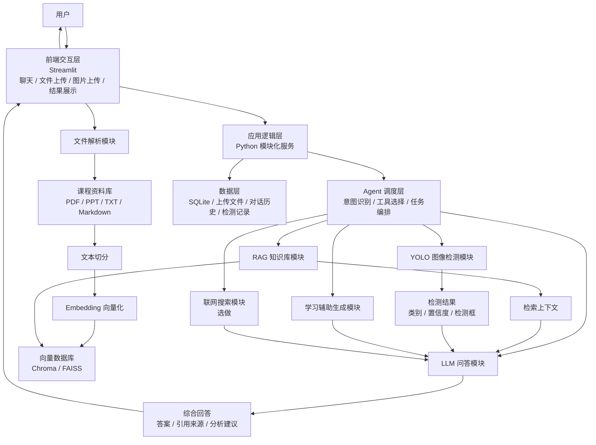
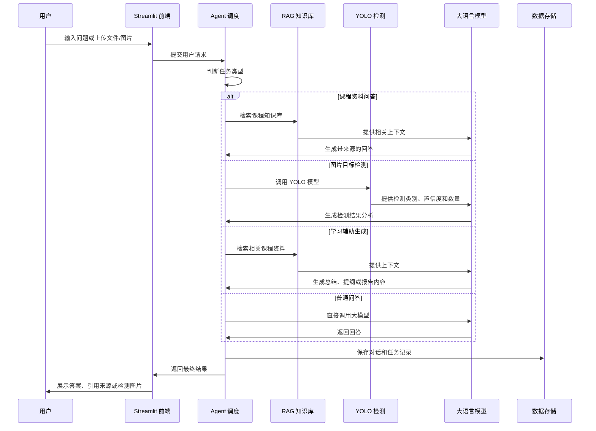
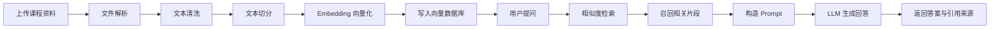
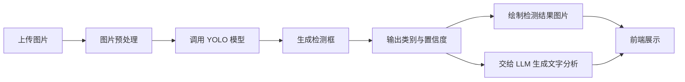
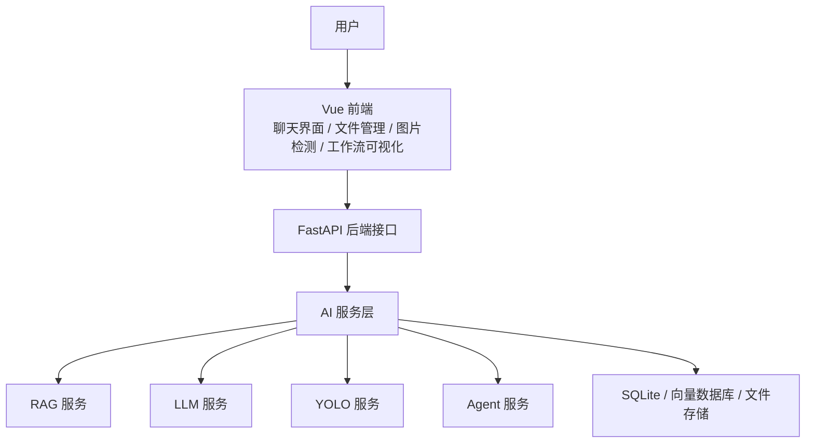

# AI 多模态学习助手系统架构图

## 1. 总体架构图

```mermaid
flowchart TD
    U["用户"] --> FE["前端交互层<br/>Streamlit<br/>聊天 / 文件上传 / 图片上传 / 结果展示"]

    FE --> APP["应用逻辑层<br/>Python 模块化服务"]

    APP --> AG["Agent 调度层<br/>意图识别 / 工具选择 / 任务编排"]

    AG --> RAG["RAG 知识库模块"]
    AG --> LLM["LLM 问答模块"]
    AG --> YOLO["YOLO 图像检测模块"]
    AG --> GEN["学习辅助生成模块"]
    AG --> SEARCH["联网搜索模块<br/>选做"]

    FE --> FILE["文件解析模块"]
    FILE --> DOCS["课程资料库<br/>PDF / PPT / TXT / Markdown"]
    DOCS --> SPLIT["文本切分"]
    SPLIT --> EMB["Embedding 向量化"]
    EMB --> VDB["向量数据库<br/>Chroma / FAISS"]

    RAG --> VDB
    RAG --> CTX["检索上下文"]
    CTX --> LLM

    YOLO --> DET["检测结果<br/>类别 / 置信度 / 检测框"]
    DET --> LLM

    GEN --> LLM
    SEARCH --> LLM

    LLM --> ANS["综合回答<br/>答案 / 引用来源 / 分析建议"]

    APP --> DB["数据层<br/>SQLite / 上传文件 / 对话历史 / 检测记录"]
    ANS --> FE
    FE --> U
```

## 2. 核心业务流程图

```mermaid
sequenceDiagram
    participant U as 用户
    participant FE as Streamlit 前端
    participant AG as Agent 调度
    participant RAG as RAG 知识库
    participant YOLO as YOLO 检测
    participant LLM as 大语言模型
    participant DB as 数据存储

    U->>FE: 输入问题或上传文件/图片
    FE->>AG: 提交用户请求
    AG->>AG: 判断任务类型

    alt 课程资料问答
        AG->>RAG: 检索课程知识库
        RAG->>LLM: 提供相关上下文
        LLM->>AG: 生成带来源的回答
    else 图片目标检测
        AG->>YOLO: 调用 YOLO 模型
        YOLO->>LLM: 提供检测类别、置信度和数量
        LLM->>AG: 生成检测结果分析
    else 学习辅助生成
        AG->>RAG: 检索相关课程资料
        RAG->>LLM: 提供上下文
        LLM->>AG: 生成总结、提纲或报告内容
    else 普通问答
        AG->>LLM: 直接调用大模型
        LLM->>AG: 返回回答
    end

    AG->>DB: 保存对话和任务记录
    AG->>FE: 返回最终结果
    FE->>U: 展示答案、引用来源或检测图片
```

## 3. RAG 知识库构建流程

```mermaid
flowchart LR
    A["上传课程资料"] --> B["文件解析"]
    B --> C["文本清洗"]
    C --> D["文本切分"]
    D --> E["Embedding 向量化"]
    E --> F["写入向量数据库"]
    F --> G["用户提问"]
    G --> H["相似度检索"]
    H --> I["召回相关片段"]
    I --> J["构造 Prompt"]
    J --> K["LLM 生成回答"]
    K --> L["返回答案与引用来源"]
```

## 4. YOLO 图像检测流程

```mermaid
flowchart LR
    A["上传图片"] --> B["图片预处理"]
    B --> C["调用 YOLO 模型"]
    C --> D["生成检测框"]
    D --> E["输出类别与置信度"]
    E --> F["绘制检测结果图片"]
    E --> G["交给 LLM 生成文字分析"]
    F --> H["前端展示"]
    G --> H
```

## 5. 后续 Vue + FastAPI 升级架构

```mermaid
flowchart TD
    U["用户"] --> VUE["Vue 前端<br/>聊天界面 / 文件管理 / 图片检测 / 工作流可视化"]
    VUE --> API["FastAPI 后端接口"]
    API --> SVC["AI 服务层"]
    SVC --> RAG["RAG 服务"]
    SVC --> LLM["LLM 服务"]
    SVC --> YOLO["YOLO 服务"]
    SVC --> AG["Agent 服务"]
    SVC --> DB["SQLite / 向量数据库 / 文件存储"]
```
